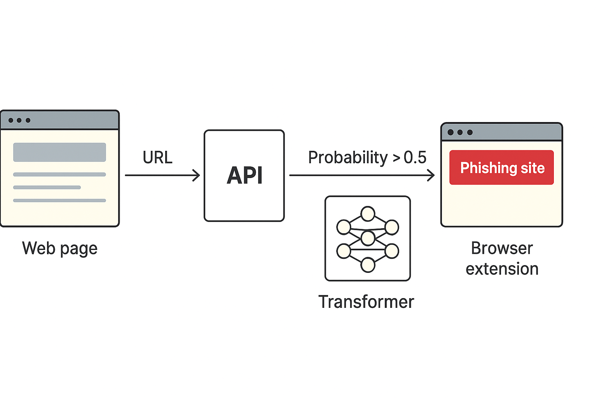

# Phish-Transformer  
A lightweight, pure-CPU transformer that detects phishing URLs and warns users inside Chrome.

[](https://python.org)
[](https://pytorch.org )  
[](https://flask.palletsprojects.com )  
[](https://developer.chrome.com/docs/extensions/mv3/intro/)

**Version 1.0 – 2025**  
Custom Commercial Licence – see [LICENSE](LICENSE) for terms.

Tested on Python 3.10–3.13

---

## Contents
- [Installation](#installation)
- [Quick Start](#quick-start)
- [Pipeline Flow](#pipeline-flow)
- [API Usage](#api-usage)
- [Model Specs](#model-specs)
- [Evaluation](#evaluation)
- [Chrome Extension](#chrome-extension)
- [Packaging](#packaging-for-chrome-web-store)
- [Possible Extensions](#possible-extensions)
- [Contributing](#contributing)
- [License](#licence)

## What It Does

1. Learns URL patterns from the [UCI PhisUSIIL Phishing URL Dataset](https://archive.ics.uci.edu/dataset/967/phiusiil+phishing+url+dataset).
2. Tokenizes each URL into 75 ASCII characters.
3. Feeds the sequence into a ~ 45k parameter transformer encoder
4. Returns a probability via a Flask REST endpoint `/predict` .
5. Displays a red banner in Chrome when the probability > 0.5.

---

## Limitations

The model judges **only the URL string** (characters, sub-domains, TLD, etc.) and does **not** fetch or inspect page content.  
It is designed as a **zero-latency first filter** against look-alike domains; content-based attacks require additional page-analysis layers.

## Future Improvements

- Integrate **content-based page analysis** to catch phishing beyond URL strings.  
- Support **real-time updates** from threat feeds to improve detection of new domains.  
- Extend multilingual support and handle **punycode / internationalized domains**.  
- Explore **edge deployment optimizations** (INT8 quantization, 1-D CNN variant).  
- Implement **user feedback loop** for continual model retraining.
---

## Folder Map

```
phish_transformer/
├── datasets/                      # UCI CSV + splits
├── models/                        # *.pt checkpoints (git-ignored)
├── src/                           # modular code
│   ├── data/                      # tokenizer + preprocessing
│   ├── model/                     # transformer definition
│   ├── training/                  # training loop
│   └── inference/                 # Flask API + evaluation
├── extension/                     # Chrome MV3 extension
├── tests/                         # pytest suite
├── main.py                        # end-to-end pipeline
├── requirements.txt               # dependencies
└── README.md                      # this file
```

---

## Installation

```bash 
git clone https://github.com/YOU/phish-transformer.git
cd phish-transformer
python -m venv venv
source venv/bin/activate        # Windows : venv\Scripts\activate
pip install -r requirements.txt # includes torch, flask, pandas, etc.
```

---

## Quick Start
```bash
# 1. Train & export
python main.py

# 2. Start API
flask --app src/inference/app run --port 8000

# 3. Load extension
Chrome → Extensions → Developer mode → Load unpacked → select extension/

# 4. Test
pytest tests/
```
---
## Pipeline Flow



---
## API Usage

**POST** `/predict`
Request :
```json
{"url" : "https://example.com"}
```

Response :
```json
{"phishing" : 0.97}
```

**CLI test**
```bash
curl -X POST http://127.0.0.1:8000/predict \
-H "Content-Type: application/json" \
-d '{"url" : "https://example.com"}'
```

**GUI testers**
- **VS Code Thunder Client**: install extension → POST → URL above → Body → raw JSON → same payload.  
- **Postman**: new request → POST → URL → Body → raw → JSON → send.

---

## Model Specs
| Layer | Value |
|-------|-------|
| Architecture | 2-layer Transformer encoder |
| Embedding dim | 32 |
| Heads | 2 |
| Feed-forward | 64 |
| Dropout | 0.1 |
| Sequence | 75 chars |
| Vocab | 96 printable ASCII tokens |
| Params | ≈ 45 k |
| Test AUC | ≈ 0.98 |

---

## Evaluation
```bash
python src/inference/evaluate.py   # produces roc.png
```
---

## Chrome Extension
1. Start Flask Server.
2. Chrome → Extensions → Developer mode → Load unpacked → select `extension/`.  
3. Browse any site; red banner appears when score > 0.5.

---

## Packaging for Chrome Web Store
1. Zip the `extension/` folder (must contain `manifest.json` at top level).  
2. Upload zip in [Chrome Developer Dashboard](https://chrome.google.com/webstore/devconsole ).  
3. Host the ≥ 1 MB model externally (Google Drive, CDN) and update `fetch()` URL in `content.js`.
---

# Possible Extensions
- Distil to 1-D CNN for < 200 kb edge deployment
- Quantization (INT8) for 2x speed-up
- On device Chrome ML (TensorFlow-Lite)
- Multilingual URL support (Unicode normalizer)
- Continuous retraining with user feedback

---
## Contributing
1. Fork 
2. Feature branch (`git checkout -b feat/awesome`)
3. Commit with clear messages
4. Push & open pull requests

---
## Acknowledgements
- UCI PhisUSIIL Phishing URL Dataset
- PyTorch, Flask, Chrome Extension APIs

---

## Licence
This project is licensed under the **GNU General Public Licence v3.0** – see [LICENSE](LICENSE) for details.  
Commercial use is allowed **only** if you open-source your entire derivative under the same licence.